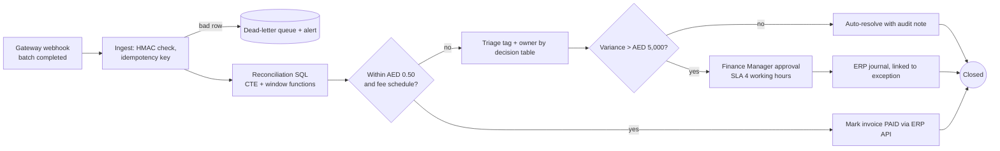
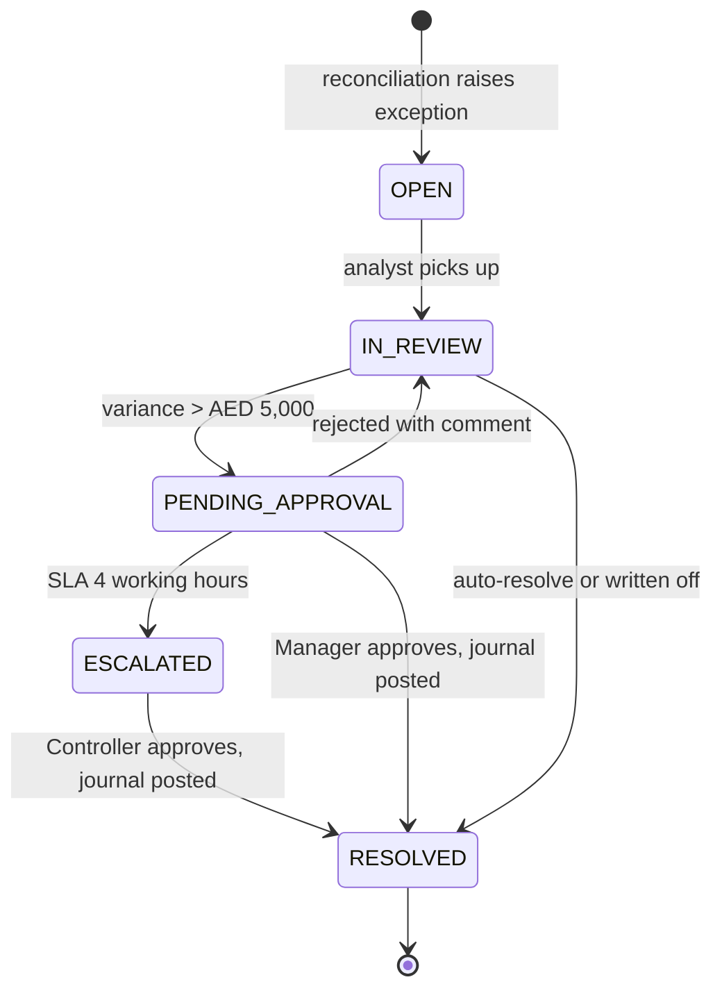
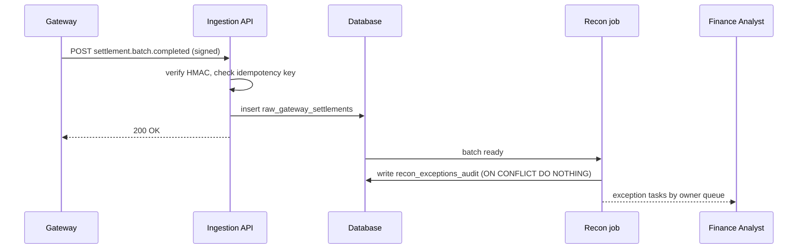
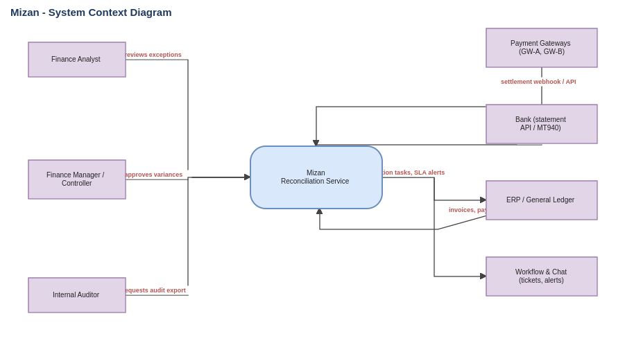
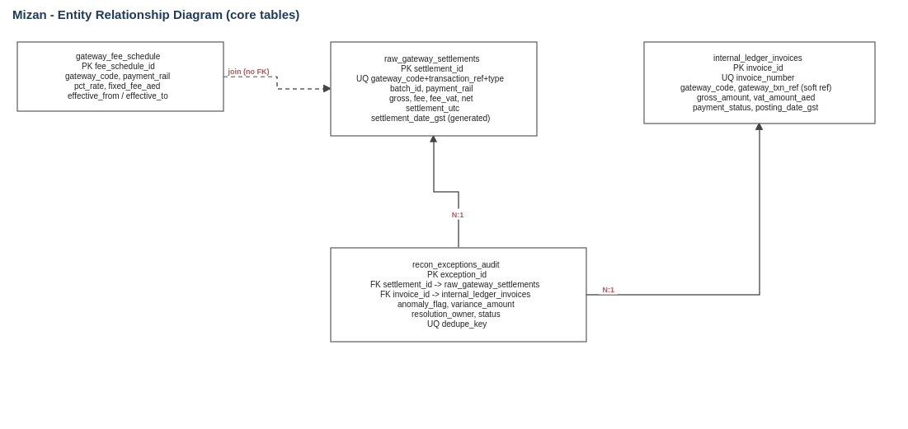
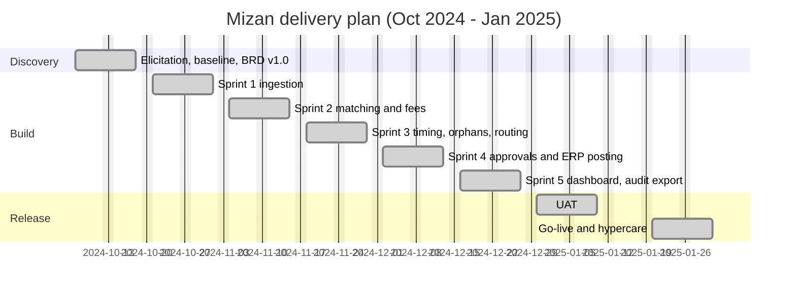

# Mizan - Fintech Invoice and Bank Reconciliation Workflow

> **Simulated portfolio project.** The company, people, data and results are fictional and were built to show how I work as a business analyst. Dates, volumes and benefit figures are modelled, not measured at a real client.

**Period:** 7 Oct 2024 - 31 Jan 2025 (Sprint 0, five sprints, UAT, hypercare)  
**My role:** Business analyst: elicitation, As-Is/To-Be process design, BRD, business rules, backlog and Gherkin, SQL logic and validation, UAT coordination, change control, KPI definitions.

## The problem

A Dubai marketplace settled about 26,000 card, wallet and instant-payment transactions a month through two gateways. Finance reconciled them every morning by downloading portal files, matching with VLOOKUP, approving exceptions by email and keying journals by hand. Fee differences and the UTC/GST date boundary produced so many false breaks that real ones were hard to see.

## How I approached it

1. Interviewed six stakeholders, shadowed the analyst for two days and profiled a week of data before writing any requirement.
2. Mapped the As-Is process in BPMN and found four manual handoffs (portal export, spreadsheet matching, email approval, manual journal).
3. Wrote the business rules first (fee pricing, VAT on fee, tolerance, timezone, grace period), then the stories and Gherkin scenarios with boundary cases.
4. Built the reconciliation logic in SQL with fixtures so every rule could be tested before development finished.
5. Ran change control for four change requests; refunds were deferred to protect the go-live date.

## To-Be flow

## Exception lifecycle

## Ingestion sequence

## Diagrams

BPMN and architecture diagrams are shown below (editable `.drawio` sources are in `02-Process-and-Diagrams/`).

## Delivery timeline

## Results (modelled)

- Handoffs per cycle: 4 to 0 (design outcome).
- Fee-dispute clearance in the simulated December run: 83.5 elapsed working hours (about 3.5 working days) against a 5.0-day baseline, a 30% reduction.
- Match rate in the simulated run: 97.4% of 26,000 settlements; 680 exceptions raised and routed.
- UAT: 13 of 14 cases passed first time; the failed SLA-timer case was fixed and retested.

## What went wrong or I would do differently

- The grace-period rule counted calendar days at first and raised weekend false positives (DEF-009). I should have asked what a working day means for the owners of orphaned records during discovery.
- The SLA timer bug (DEF-013) reached UAT because the system-integration tests did not cover working hours. I added a working-hours timer test to the definition of done.
- Fee-dispute exceptions take days because they depend on the gateway; I set their SLA to 120 working hours instead of forcing them into a 24-hour target.

## What is in this folder

- `01-Requirements/`
  - `Mizan_BRD_Excerpts.docx`
  - `Mizan_Requirements_Gathering_Report.docx`
- `02-Process-and-Diagrams/`
  - `Mizan_BPMN_AsIs.drawio`
  - `Mizan_BPMN_AsIs.svg`
  - `Mizan_BPMN_ToBe.drawio`
  - `Mizan_BPMN_ToBe.svg`
  - `Mizan_Context_Diagram.drawio`
  - `Mizan_Context_Diagram.svg`
  - `Mizan_ERD.drawio`
  - `Mizan_ERD.svg`
- `02-Process-and-Diagrams/mermaid/` (5 files)
- `03-Jira-and-Agile/`
  - `Jira_Project_Setup_MIZ.md`
  - `jira_import_MIZ.csv`
- `03-Jira-and-Agile/gherkin-features/` (11 files)
- `04-Confluence-Pages/`
  - `00_Space_Home_and_Page_Tree.md`
  - `01_Requirements_Workshop_Notes.md`
  - `02_Business_Rules_and_Glossary.md`
  - `03_Decision_Log.md`
  - `04_Definition_of_Ready_and_Done.md`
  - `05_Sprint_Reviews_and_Retrospectives.md`
  - `06_UAT_Plan_and_Signoff.md`
  - `07_Release_Notes_v1.0.md`
- `05-Data-and-Code/`
  - `common.py`
  - `synthetic_data_and_recon_simulation.py`
- `05-Data-and-Code/sample-data/` (4 files)
- `05-Data-and-Code/sql/`
  - `01_schema_ddl.sql`
  - `02_recon_triage_view.sql`
  - `03_recon_run_insert.sql`
  - `04_fixtures_and_assertions.sql`
  - `05_data_quality_validations.sql`
- `06-Governance-and-Tracking/`
  - `Mizan_Governance_and_KPI_Workbook.xlsx`
- `07-Dashboards/`
  - `Mizan_Reconciliation_Control_Tower.html`

## How to use the files

- **Jira:** import `03-Jira-and-Agile/jira_import_MIZ.csv` (steps in the setup file). Gherkin is in the issue descriptions and in `gherkin-features/`.
- **Confluence:** pages in `04-Confluence-Pages/` are Markdown; paste with Insert > Markup > Markdown, or import the Word documents from the requirements folder.
- **Diagrams:** open `.drawio` files in diagrams.net (Lucidchart: Import > draw.io). SVG and PNG copies sit beside them; Mermaid sources are in `02-Process-and-Diagrams/mermaid/`.
- **Data and code:** SQL and the synthetic-data script are in `05-Data-and-Code/`; sample data is synthetic.
