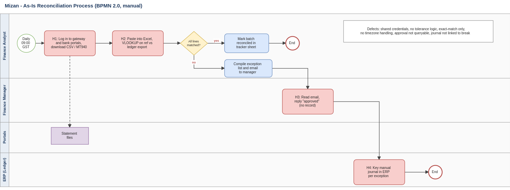
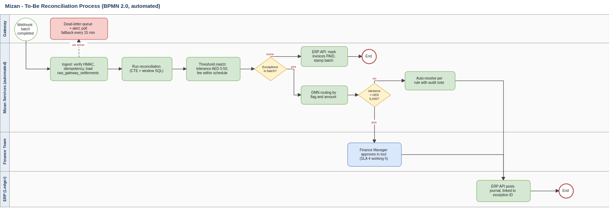

# Fintech Invoice & Bank Reconciliation Platform
### Cross-Team Operational Case Study | Business Analysis & Process Governance

  

> **Scenario status:** a simulated engagement built to demonstrate my business analysis method. The company, stakeholders and data are fictional, results are modelled, and no confidential material is involved. The artifacts were AI-assisted, then directed and reviewed by me.

---

## 1. Project Context

A Dubai-based payments marketplace settles roughly **26,000 transactions a month** (card, wallet, instant payment) through two gateways. Finance reconciled gateway settlements to ledger invoices by hand every morning, and four recurring problems made real breaks hard to see:

| Friction | Business impact |
|---|---|
| **Four manual handoffs** (portal export, spreadsheet matching, email approval, manual journal) | Slow cycle time; no audit trail for approvals |
| **Exact-match spreadsheet logic** | Gateway fee differences flagged as breaks; real exceptions buried |
| **UTC vs Gulf Standard Time (UTC+4) date boundary** | False month-end breaks for settlements after 20:00 UTC |
| **Fees not priced against the contract** | Gateway overcharges undetected; no evidence for disputes |

**Objective:** define the requirements, business rules and process redesign needed to move from manual matching to rule-based exception handling, with every adjustment approved, posted and traceable.

---

## 2. BA Governance Artifacts (the focus of this repository)

| Artifact | What it shows | Location |
|---|---|---|
| **Requirements gathering report** | Elicitation plan (interviews, shadowing, data profiling), findings, baseline, open questions | [`01-Requirements/Mizan_Requirements_Gathering_Report.docx`](01-Requirements/) |
| **Business Requirements Document (excerpts)** | Objectives, scope in/out, BR/FR/NFR, business-rules catalogue (BRL-01 to BRL-10), gap analysis, sign-off | [`01-Requirements/Mizan_BRD_Excerpts.docx`](01-Requirements/) |
| **As-Is / To-Be process maps (BPMN 2.0)** | Swimlane models that remove the 4 manual handoffs | [`02-Process-and-Diagrams/`](02-Process-and-Diagrams/) (`.drawio`, `.svg`, `.png`) |
| **Prioritized sprint backlog** | 5 epics, 11 stories, 70 story points, MoSCoW priority, Fibonacci sizing | [`03-Jira-and-Agile/jira_import_MIZ.csv`](03-Jira-and-Agile/jira_import_MIZ.csv) |
| **Gherkin acceptance criteria** | Given/When/Then scenarios with boundary and negative cases, one feature file per story | [`03-Jira-and-Agile/gherkin-features/`](03-Jira-and-Agile/gherkin-features/) |
| **Governance workbook** | Stakeholder register, RACI, requirements traceability, RAID log, change log (4 CRs), UAT cases, defect log and severity triage matrix | [`06-Governance-and-Tracking/Mizan_Governance_and_KPI_Workbook.xlsx`](06-Governance-and-Tracking/) |
| **KPI monitoring workbook & exception tracker** | Match rate, clearance velocity, SLA breach and daily resolution rate (formula-driven) | Same workbook: `KPI Tracker`, `Exception Tracker`, `Daily Resolution` sheets |

### Process redesign at a glance

| | As-Is | To-Be |
|---|---|---|
| Data acquisition | Manual portal export | Signed webhook with polling fallback |
| Matching | Spreadsheet VLOOKUP, exact match | Rule-based match with AED 0.50 tolerance and fee-schedule pricing |
| Timing differences | Explained by hand | Tagged `TIMING_MISMATCH_TIMEZONE` |
| Approval | Email reply | In-tool approval above AED 5,000, 4-working-hour SLA, escalation |
| Ledger adjustment | Manual journal | Posted via API, linked to the exception |

---

## 3. Technical Systems Verification

SQL was used as a **verification tool** to test the business rules, not as the headline deliverable. The reconciliation logic uses CTEs, a full outer join (to expose orphans on both sides), window functions (latest non-void invoice per transaction) and a fee-schedule join by effective date. The business rule it enforces: **net variance within AED 0.50 is a match; anything else is triaged.**

| Item | Location |
|---|---|
| Schema (gateway settlements, ledger invoices, exception audit, fee schedule) | [`05-Data-and-Code/sql/01_schema_ddl.sql`](05-Data-and-Code/sql/) |
| Reconciliation and triage view | [`05-Data-and-Code/sql/02_recon_triage_view.sql`](05-Data-and-Code/sql/) |
| Fixture-based assertions (one row per rule) | [`05-Data-and-Code/sql/04_fixtures_and_assertions.sql`](05-Data-and-Code/sql/) |
| Eight data-quality validation queries | [`05-Data-and-Code/sql/05_data_quality_validations.sql`](05-Data-and-Code/sql/) |

**Modelled results (synthetic December data set, 26,000 settlements):**

| Measure | Result |
|---|---|
| Handoffs per cycle | 4 to 0 (design outcome) |
| Match rate | 97.4% |
| Exceptions flagged | 680 (timing, fee variance, orphaned records) |
| Fee-dispute clearance | about 3.5 working days against a 5.0-day baseline (30% reduction, modelled) |
| UAT | 13 of 14 cases passed first time; 1 retest passed |
| Defects | 13 logged and triaged by severity (S1 to S4) |

> **Transparency note:** the matching rules were run in Python to mirror the SQL on synthetic data. The SQL itself has not been executed against a production database.

---

## 4. Scope & Disclosure

| | |
|---|---|
| **Nature** | Simulated portfolio case study; not client work |
| **Data** | 100% synthetic; no real transactions, customers or financial records |
| **Confidentiality** | Nothing in this repository is confidential, so no NDA applies |
| **Results** | Modelled from the synthetic data set, not measured at a real organisation |
| **Authorship** | AI-assisted drafting; business rules, structure and review directed by me |
