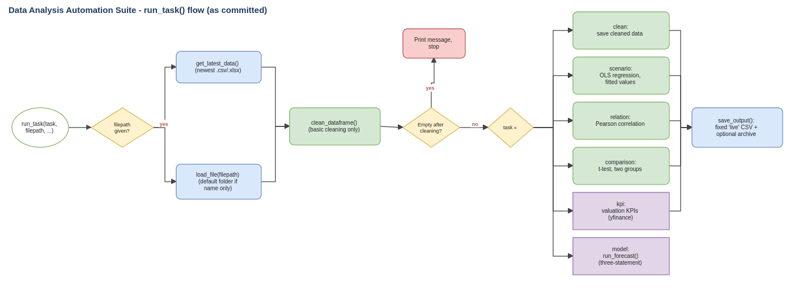

# Enterprise Data Automation & Decision Platform
### Product Architecture & Agile Governance | Business Analysis Case Study

  

> **Status:** a personal Python analysis suite, documented and reviewed afterwards as a business analyst. The code is real and public; it is not deployed as a hosted system. Documents were AI-assisted, then directed and reviewed by me. Evidence in this folder is marked **Verified** (I ran it) or **Read from code**.

---

## 1. Executive Summary

Analysts repeat the same steps for every new dataset: tidy the file, test a relationship, compare groups, compute valuation figures, rebuild a forecast. Done in spreadsheets, each step is manual, undocumented and hard to repeat with confidence.

This case study treats the suite as a product: it reverse-engineers the requirements, documents how it works, audits whether it behaves as documented, and turns the gaps into a prioritized backlog.

| Question | Answer |
|---|---|
| **What does the product do?** | Cleans a CSV or Excel file and runs one chosen analysis (regression, correlation, two-group t-test, valuation KPIs, five-year DCF forecast) through a single task runner, saving results to a fixed file for dashboards |
| **Business need** | One repeatable, documented path from raw file to analysis output, replacing repetitive spreadsheet preparation |
| **Where is it today?** | Core cleaning and statistics work; five defects stop the runner on a clean checkout; the forecast formulas need correction |
| **What is the plan?** | A 14-story, 61-point improvement backlog, with a benchmark story to turn unmeasured benefit claims into evidence |

---

## 2. Product Management & Governance Artifacts

| Artifact | What it shows | Location |
|---|---|---|
| **Requirements & scope** | Functional and non-functional requirements reverse-engineered from the code, with status per requirement; business rules BRL-01 to BRL-14 | [`01-Requirements-and-Review/DAA_Requirements_and_Scope.docx`](01-Requirements-and-Review/) |
| **System documentation** | Module inventory, run flow, inputs and outputs, forecast model, dependencies | [`01-Requirements-and-Review/DAA_System_Documentation.docx`](01-Requirements-and-Review/) |
| **System interaction diagrams** | Task-runner flow, module dependencies, forecast calculation chain | [`02-Process-and-Diagrams/`](02-Process-and-Diagrams/) (`.drawio`, `.svg`, `.png`) |
| **Product backlog** | 5 epics, **14 stories, 61 story points**, MoSCoW priority, Fibonacci sizing | [`03-Jira-and-Agile/jira_import_DAA.csv`](03-Jira-and-Agile/jira_import_DAA.csv) |
| **Acceptance criteria** | Gherkin Given/When/Then per story, including negative and boundary scenarios | [`03-Jira-and-Agile/gherkin-features/`](03-Jira-and-Agile/gherkin-features/) |
| **Gap analysis & review findings** | Documented behaviour vs committed code, 13 findings with evidence and fixes | [`01-Requirements-and-Review/DAA_Review_Findings_and_Gap_Analysis.docx`](01-Requirements-and-Review/) |
| **Registers workbook** | Findings, backlog, claims register, verification results, RAID | [`06-Governance-and-Tracking/DAA_Review_and_Backlog_Workbook.xlsx`](06-Governance-and-Tracking/) |

**Backlog structure**

| Epic | Priority | Stories |
|---|---|---|
| Reliability Fixes | Must | 5 (runner starts, finishes, forecast works) |
| Configuration & Portability | Must | 2 |
| Data Quality & Statistics | Should | 3 |
| Forecast Model Correctness | Should | 2 |
| Testing & Evidence | Should | 2 |

---

## 3. Live Execution & Technical Layer

<table>
<tr>
<td>

### Source code repository

The Python modules, data-cleaning engine and call notebooks live in a separate technical repository.

**Contains:** task runner, cleaning module, regression / correlation / t-test functions, valuation KPI module, DCF forecast and three-statement building blocks, call notebooks.

**Reviewed at commit:** `a04c40c`

</td>
</tr>
</table>

> **Deployment status:** the suite runs locally from notebooks or scripts. There is no hosted or production environment. [`05-Verification/verify_core_functions.py`](05-Verification/) reproduces the offline checks against a clone of the source repository.

---

## 4. Impact Metrics

### Audit results

| Metric | Result |
|---|---|
| Findings logged | **13** (3 high, 5 medium, 4 low, 1 information) |
| Clean-checkout failures verified | 5 (import-time error, missing `run_forecast`, mismatched KPI call, missing import, save failure) |
| Verification checks recorded | 12 (5 fail, 6 pass or behave as documented, 1 not run: needs live market data) |
| Backlog created from findings | 14 stories, 61 story points |

### Highest-impact data-quality finding

The cleaning step replaces every missing number with 0, and later statistics treat those zeros as real observations. On the seeded test set (60 rows, 2 missing values):

| Handling of missing values | Regression R-squared | Rows used |
|---|---|---|
| Blanks left out | **0.79** | 58 |
| Replaced with 0 (current rule) | **0.44** | 60 |

The zero-fill rule **lowers the model fit by about 44%**; it is raised as a high-priority data-quality story (DAA-108), not presented as an optimization.

### Claims register (benefit evidence tracker)

The original notes quote speed, hours-saved and accuracy figures. None was measured, so each is tracked with its evidence status.

| Claim in source notes | Evidence status | Next step |
|---|---|---|
| 70-80% faster analytics workflows | Not measured | Benchmark story DAA-114 |
| 10-15 analyst hours saved per week | Not measured | Time a sample workload before and after |
| 30-40% better reliability | Not measured | Define the metric first |
| 20% faster, 10-12% more accurate valuations | Not measured; model inputs unvalidated | Compare with a reference model after DAA-111 |
| Reusable cleaning, statistics, KPI and forecast functions | **Supported** (core functions executed) | None |

---

### Disclosure

| | |
|---|---|
| **Nature** | Personal project: real code, documented and reviewed afterwards |
| **Data** | Synthetic test data only |
| **Benefit figures** | Listed as unmeasured until the benchmark story is done |
| **Authorship** | AI-assisted drafting; analysis, structure and review directed by me |
