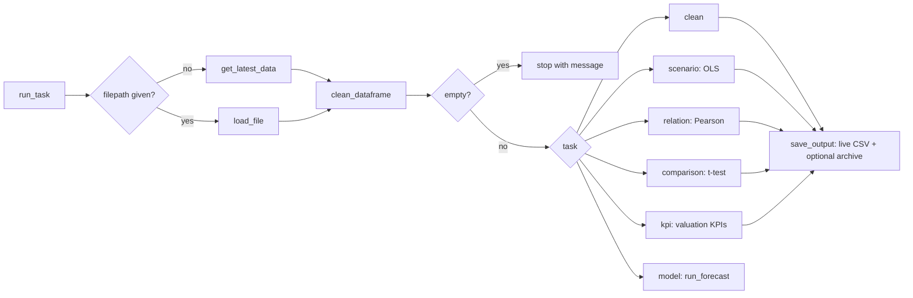
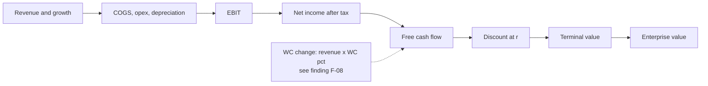
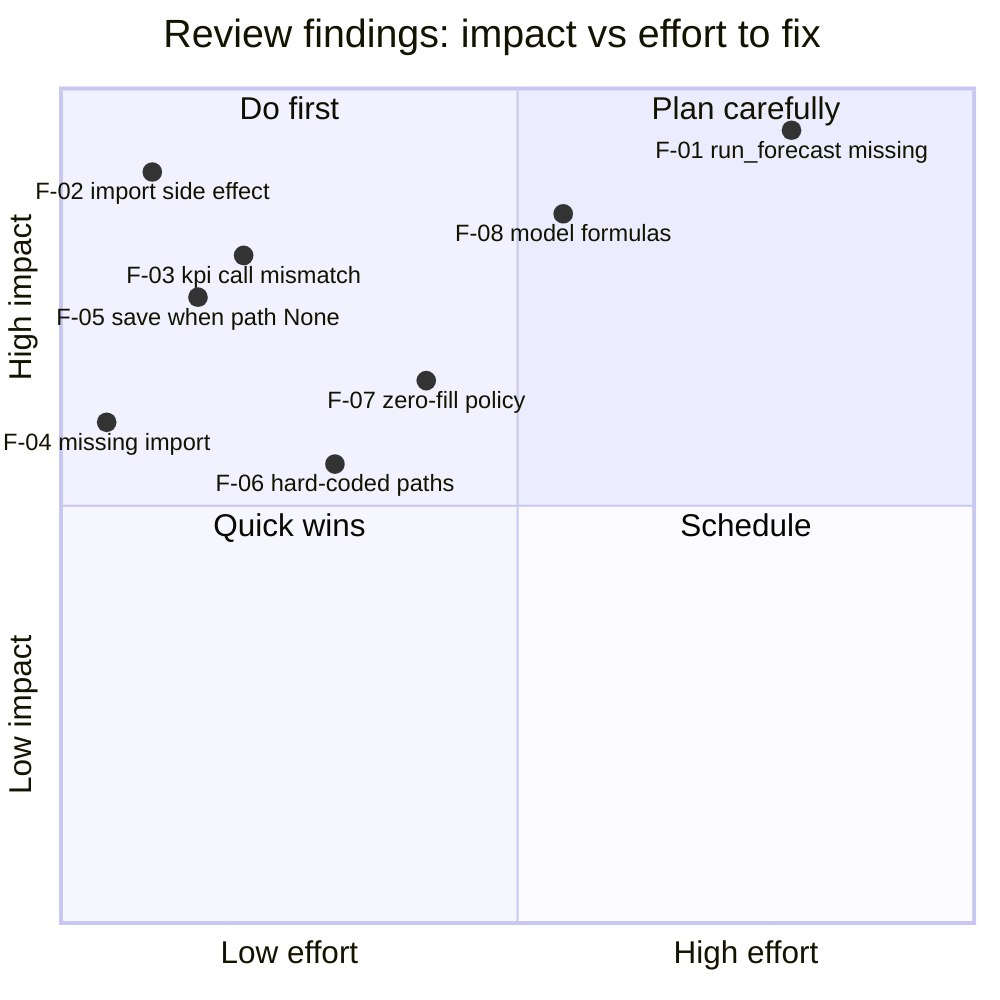

# Data Analysis Automation Suite

> **Real project, reviewed after the fact.** The code is my own Python project (https://github.com/700imran/data-analysis-automation-script). The requirements, review and backlog here were written afterwards; nothing in them is client data. Evidence is marked *Verified* (I ran it) or *Read from code*.

**Source:** https://github.com/700imran/data-analysis-automation-script (reviewed at commit `a04c40c`, 30 Dec 2025)  
**My role here:** owner of the code; business analyst for the documentation: reverse-engineered requirements, system documentation, review findings, verification, and an improvement backlog.

## What the suite does

A Python suite that cleans a CSV or Excel file and runs one chosen analysis (regression, correlation, two-group t-test, valuation KPIs from market data, or a DCF forecast), then saves the result to a fixed file that a dashboard or workbook can read. About 800 lines across twelve modules, with one notebook per module showing how to call it.

## Run flow



## Example: scenario analysis

```mermaid
sequenceDiagram
  participant U as Analyst
  participant R as task_runner
  participant C as primary_clean_utils
  participant A as analysis_utils
  participant O as output_utils
  U->>R: run_task("scenario", "Stores.csv")
  R->>C: clean_dataframe(df)
  C-->>R: standardised dataframe
  R->>U: list columns, ask predictors and target
  U-->>R: store_area, daily_customer_count / store_sales
  R->>A: prepare_regression(df, predictors, target)
  A-->>R: fitted OLS model
  R->>R: df.scenario_prediction = fittedvalues
  R->>O: save_output(df, filepath, "scenario")
  O-->>U: live CSV updated; asks about archive copy
```

## Forecast calculation chain



## What I found when I reviewed it

I read every module, then ran the offline-testable functions on a seeded synthetic dataset. The full list with evidence is in `01-Requirements-and-Review/DAA_Review_Findings_and_Gap_Analysis.docx`. In short:

- **Works:** cleaning, regression, correlation, t-test and the simple DCF projection when called from a notebook or script.
- **Fails on a clean checkout (Verified):** importing `task_runner` raises `FileNotFoundError` (an example call was left at module level); `run_forecast` is imported and documented but not defined; the `kpi` task calls `valuation_kpis` with the wrong arguments; `default_folder.py` is missing a pandas import; saving fails when the file path is auto-selected.
- **Can bias results (Verified):** every missing number is replaced by 0. On my test data a regression fell from R-squared 0.789 (blanks left out) to 0.436 (zero-filled).
- **Forecast formulas need correction:** working-capital change is taken as a level, and NPV is a fixed 10% of final-year free cash flow.
- **Unmeasured claims:** the README quotes speed, hours-saved and accuracy figures that have no measurement behind them. The claims register lists each one and what evidence would support it; I do not repeat them as results.
- **Not run:** the Yahoo Finance functions (KPI, assumptions, benchmarks) need internet access.



## Improvement backlog

Fourteen stories, 61 story points, all To Do (nothing is built yet), grouped into five epics: reliability fixes, configuration and portability, data quality and statistics, forecast correctness, testing and evidence. Each story has Gherkin acceptance criteria.

## What I would do next

1. Fix the five failures above so the runner starts and finishes (DAA-102, 104, 105, 103), then add `run_forecast` and correct the formulas together (DAA-101, 111).
2. Replace the hard-coded Windows paths with one configuration (DAA-106) and add a requirements file (DAA-107).
3. Add tests and a small benchmark so the effort and speed claims become measured figures (DAA-113, 114).

## What is in this folder

- `01-Requirements-and-Review/`
  - `DAA_Requirements_and_Scope.docx`
  - `DAA_Review_Findings_and_Gap_Analysis.docx`
  - `DAA_System_Documentation.docx`
  - `DAA_Verification_Log.docx`
- `02-Process-and-Diagrams/`
  - `DAA_Forecast_Calculation_Chain.drawio`
  - `DAA_Forecast_Calculation_Chain.svg`
  - `DAA_Module_Dependency_Diagram.drawio`
  - `DAA_Module_Dependency_Diagram.svg`
  - `DAA_Task_Runner_Flow.drawio`
  - `DAA_Task_Runner_Flow.svg`
- `02-Process-and-Diagrams/mermaid/` (4 files)
- `03-Jira-and-Agile/`
  - `Jira_Project_Setup_DAA.md`
  - `jira_import_DAA.csv`
- `03-Jira-and-Agile/gherkin-features/` (14 files)
- `04-Confluence-Pages/`
  - `00_Space_Home_and_Page_Tree.md`
  - `01_How_To_Run.md`
  - `02_Design_Notes_As_Committed.md`
  - `03_Known_Issues.md`
  - `04_Backlog_and_Definition_of_Done.md`
  - `05_Source_History.md`
- `05-Verification/`
  - `README.md`
  - `verification_output.txt`
  - `verify_core_functions.py`
- `06-Governance-and-Tracking/`
  - `DAA_Review_and_Backlog_Workbook.xlsx`

## How to use the files

- **Verification:** `python 05-Verification/verify_core_functions.py <path-to-cloned-repo>` reruns the offline checks; `verification_output.txt` is the output from my run.
- **Jira:** import `03-Jira-and-Agile/jira_import_DAA.csv`; Gherkin is in the descriptions and in `gherkin-features/`.
- **Diagrams:** `.drawio` files open in diagrams.net (Lucidchart: Import > draw.io); SVG, PNG and Mermaid copies are alongside.
