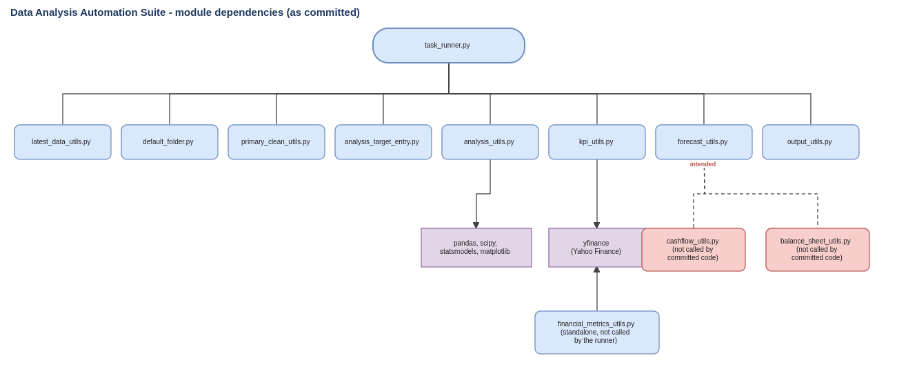
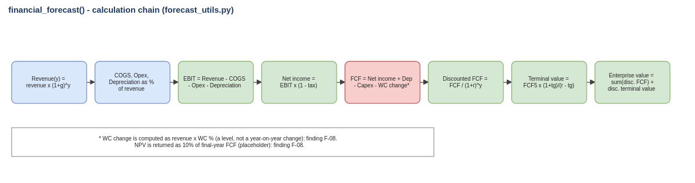

# Data Analysis Automation Suite (Python, pandas, Statistics)

> **Real code, documented and reviewed afterwards.** Source: https://github.com/700imran/data-analysis-automation-script (reviewed at commit `a04c40c`). Figures below come from running that code on synthetic test data. Evidence is marked *Verified* (I ran it) or *Read from code*.

A Python suite (12 modules, about 800 lines) that cleans a CSV or Excel file and runs one chosen analysis (regression, correlation, two-group t-test, valuation KPIs from market data, DCF forecast) through a single task runner, then saves the result to a fixed output file for dashboards.

## Deliverables

| Deliverable | File |
|---|---|
| Requirements reverse-engineered from the code | `01-Requirements-and-Review/DAA_Requirements_and_Scope.docx` |
| System documentation (modules, run flow, forecast model) | `01-Requirements-and-Review/DAA_System_Documentation.docx` |
| Review findings, gap analysis and claims register | `01-Requirements-and-Review/DAA_Review_Findings_and_Gap_Analysis.docx` |
| Verification log and the script that reproduces it | `01-Requirements-and-Review/DAA_Verification_Log.docx`, `05-Verification/` |
| Improvement backlog with Gherkin acceptance criteria | `03-Jira-and-Agile/jira_import_DAA.csv`, `gherkin-features/` (14 stories, 61 story points) |
| Findings, backlog, claims and verification registers | `06-Governance-and-Tracking/DAA_Review_and_Backlog_Workbook.xlsx` |
| Run-flow, module and forecast diagrams | `02-Process-and-Diagrams/` (`.drawio`, `.svg`, `.png`) |

## Diagrams

## What the review found

- **Works (Verified):** cleaning, regression, correlation, t-test and the simple DCF projection, called from a notebook or script.
- **Fails on a clean checkout (Verified):** `import task_runner` raises `FileNotFoundError` (an example call sits at module level); `run_forecast` is imported and documented but not defined; the `kpi` task calls `valuation_kpis` with the wrong arguments; `default_folder.py` is missing a pandas import; saving fails when the file path is auto-selected.
- **Can bias results (Verified):** every missing number becomes 0. On the test data a regression's R-squared fell from 0.789 (blanks left out) to 0.436 (zero-filled).
- **Forecast formulas need correction (Read from code):** working-capital change is taken as a level, and NPV is a fixed 10% of final-year free cash flow.
- **Unmeasured claims:** the original notes quote speed, hours-saved and accuracy figures with no measurement. The claims register lists each one; none is repeated here as a result.
- **Not run:** the Yahoo Finance functions (KPI, assumptions, benchmarks) need internet access.

## Next steps

1. Fix the five failures so the runner starts and finishes (DAA-102, 104, 105, 103), then add `run_forecast` and correct the formulas together (DAA-101, 111).
2. Replace hard-coded Windows paths with one configuration and add a requirements file (DAA-106, 107).
3. Add tests and a small benchmark so the speed and effort claims become measured (DAA-113, 114).

## Folder contents

- `01-Requirements-and-Review/`
  - `DAA_Requirements_and_Scope.docx`
  - `DAA_Review_Findings_and_Gap_Analysis.docx`
  - `DAA_System_Documentation.docx`
  - `DAA_Verification_Log.docx`
- `02-Process-and-Diagrams/`
  - `DAA_Forecast_Calculation_Chain.drawio`
  - `DAA_Forecast_Calculation_Chain.svg`
  - `DAA_Module_Dependency_Diagram.drawio`
  - `DAA_Module_Dependency_Diagram.svg`
  - `DAA_Task_Runner_Flow.drawio`
  - `DAA_Task_Runner_Flow.svg`
- `03-Jira-and-Agile/`
  - `jira_import_DAA.csv`
- `03-Jira-and-Agile/gherkin-features/` (14 files)
- `05-Verification/`
  - `README.md`
  - `verification_output.txt`
  - `verify_core_functions.py`
- `06-Governance-and-Tracking/`
  - `DAA_Review_and_Backlog_Workbook.xlsx`

Verification: `python 05-Verification/verify_core_functions.py <path-to-cloned-repo>` reruns the offline checks; `verification_output.txt` is the output from my run.
