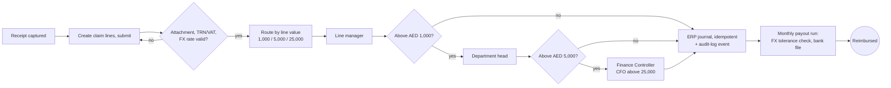
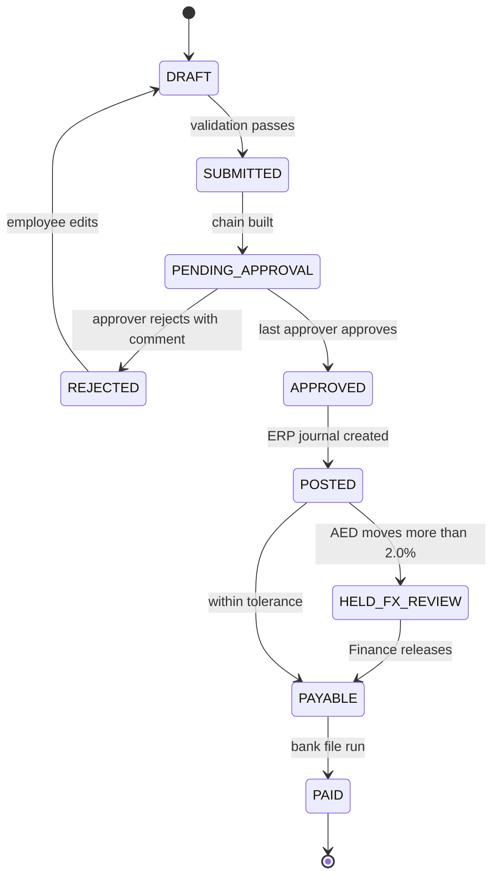
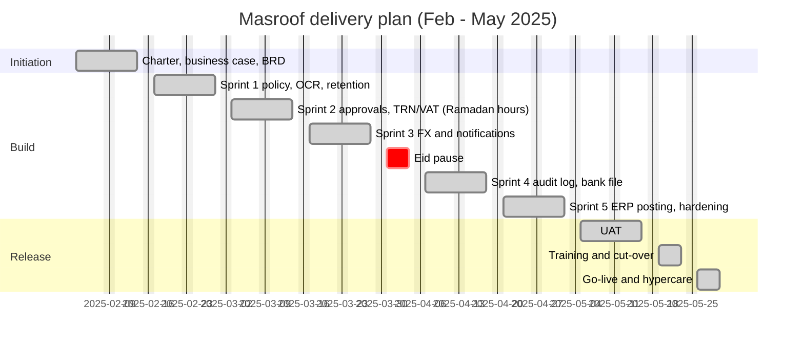

# Masroof - Expense Management and Operational Tracking Platform

> **Simulated portfolio project.** The company, people, data and results are fictional and were built to show how I work as a business analyst. Dates, volumes and benefit figures are modelled, not measured at a real client.

**Period:** 3 Feb - 30 May 2025 (Sprint 0 + 5 sprints, Ramadan and Eid adjustments, UAT, go-live 26 May)  
**My role:** Business analyst and delivery governance: charter, business case with build vs buy, scope statement, BRD, SRS, personas and journey maps, MoSCoW backlog, Gherkin, RAID, change control, UAT and executive reporting.

## The problem

A trading and logistics group of about 250 people in Dubai, Abu Dhabi and Riyadh ran expense claims through spreadsheets, photos and email. Approval limits were not enforced, VAT was claimed on invoices without a TRN, foreign-currency claims were converted at whichever rate was handy, and audit history could be edited.

## How I approached it

1. Combined interviews, a 62-person survey, a receipt sample and observation of the reimbursement run to find the real problems.
2. Compared custom build, SAP Concur and Expensify on four vectors: UAE VAT and Corporate Tax handling, ERP latency, per-seat cost and audit-log data residency.
3. Prioritised with MoSCoW into six epics; release 1 was 69 story points across four epics.
4. Wrote 12 sprint-ready stories with Gherkin, including a multi-currency story where the rate moves between submission and payout, and the USD peg that removes FX movement for USD.
5. Kept scope stable with change control: per-diem allowances (+13 SP) were deferred; the SAR currency and a threshold change were approved.

## Approval process

## Expense line lifecycle

## Delivery timeline

## Results (modelled)

- All 69 release-1 story points delivered; budget AED 556,000 against AED 554,000 plan (0.4% over, simulated).
- 13 defects found across system-integration and UAT, all closed; no open S1 or S2 at go-live.
- UAT: 12 of 13 cases passed first time; the bank-file format defect was fixed and retested.

## What went wrong or I would do differently

- Late bank-file specification caused rework (CR-005). Next time I would ask AP for the bank's format in discovery rather than in Sprint 4.
- Ramadan working hours cut capacity by about 20%; planning Sprints 2 and 3 at 16 points instead of 20 kept commitments honest.
- Adoption is still an open risk (RK-06); a champion in each office was added to the cut-over plan.

## What is in this folder

- `01-Requirements-and-Project-Docs/`
  - `Masroof_BRD.docx`
  - `Masroof_Business_Case_Build_vs_Buy.docx`
  - `Masroof_Change_Control_Procedure.docx`
  - `Masroof_Executive_Status_Report.docx`
  - `Masroof_Personas_Journey_UseCases.docx`
  - `Masroof_Project_Charter.docx`
  - `Masroof_Requirements_Gathering_Report.docx`
  - `Masroof_SRS.docx`
  - `Masroof_Scope_Statement.docx`
  - `Masroof_UAT_Plan_and_Signoff.docx`
- `02-Process-and-Diagrams/`
  - `Masroof_Architecture_Diagram.drawio`
  - `Masroof_Architecture_Diagram.svg`
  - `Masroof_BPMN_Approval_Process.drawio`
  - `Masroof_BPMN_Approval_Process.svg`
  - `Masroof_Context_Diagram.drawio`
  - `Masroof_Context_Diagram.svg`
  - `Masroof_Customer_Journey_Map.drawio`
  - `Masroof_Customer_Journey_Map.svg`
  - `Masroof_UseCase_Diagram.drawio`
  - `Masroof_UseCase_Diagram.svg`
- `02-Process-and-Diagrams/mermaid/` (5 files)
- `03-Jira-and-Agile/`
  - `Jira_Project_Setup_MAS.md`
  - `jira_import_MAS.csv`
- `03-Jira-and-Agile/gherkin-features/` (12 files)
- `04-Confluence-Pages/`
  - `00_Space_Home_and_Page_Tree.md`
  - `01_Policy_Workshop_Notes.md`
  - `02_Business_Rules_and_Glossary.md`
  - `03_Decision_Log.md`
  - `04_Definition_of_Ready_and_Done.md`
  - `05_Sprint_Reviews_and_Retrospectives.md`
  - `06_Release_Notes_v1.0.md`
  - `07_Cutover_and_Hypercare_Plan.md`
- `05-Data-and-Code/`
- `05-Data-and-Code/sql/`
  - `01_core_schema.sql`
  - `02_approval_tier_and_fx_rules.sql`
  - `03_audit_chain_verification.sql`
- `06-Governance-and-Tracking/`
  - `Masroof_Governance_Workbook.xlsx`
- `07-Dashboards/`
  - `Masroof_Delivery_Executive_Dashboard.html`

## How to use the files

- **Jira:** import `03-Jira-and-Agile/jira_import_*.csv` (steps in the Jira setup file). Gherkin is in the issue descriptions and in `gherkin-features/`.
- **Confluence:** pages in `04-Confluence-Pages/` are Markdown; paste with Insert > Markup > Markdown, or import the Word documents from the requirements folder.
- **Lucidchart / diagrams.net:** open the `.drawio` files in diagrams.net, or in Lucidchart use Import > draw.io. SVG and PNG copies sit beside them. Mermaid sources are in `02-Process-and-Diagrams/mermaid/` and render on GitHub.
- **Data and code:** SQL, Python and DAX are in `05-Data-and-Code/`; sample data is synthetic.
