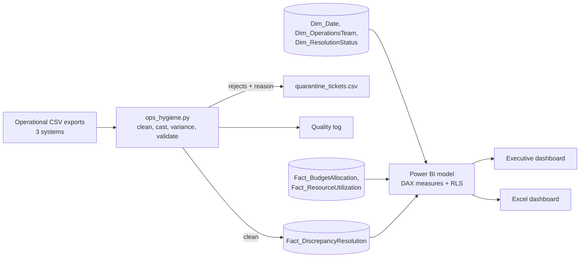
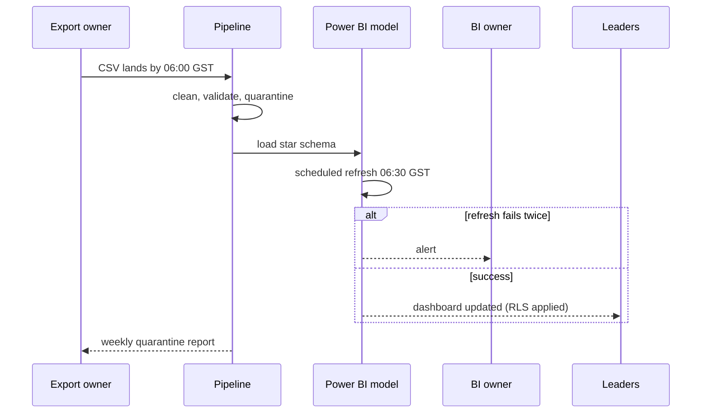
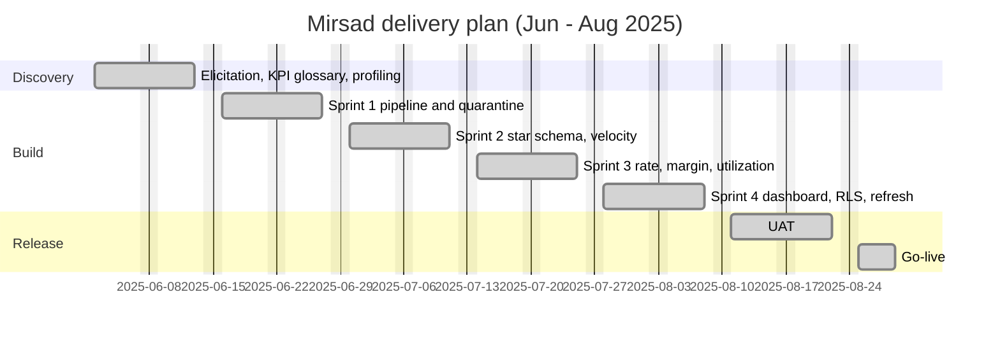

# Mirsad - Operational KPI and Business Intelligence Reporting

> **Simulated portfolio project.** The company, people, data and results are fictional and were built to show how I work as a business analyst. Dates, volumes and benefit figures are modelled, not measured at a real client.

**Period:** 2 Jun - 29 Aug 2025 (Sprint 0 + 4 sprints + UAT + go-live)  
**My role:** Business analyst: KPI definition workshop, glossary and data dictionary, data profiling, Python cleaning rules, star schema and DAX specification, dashboard design, UAT.

## The problem

A regional fulfilment and operations company produced its weekly report from eleven spreadsheets. Three teams used three meanings of 'resolved', weekend hours inflated Friday tickets, dates arrived in five formats and about 7% of rows had missing ids or impossible dates.

## How I approached it

1. Inventoried the existing reports and agreed one definition per KPI in a workshop before building anything.
2. Wrote the cleaning rules and reason codes with the operations analyst, then ran the pipeline on messy sample data to confirm each rule fired.
3. Designed a star schema with two date relationships so the daily resolution rate can use the resolution date.
4. Wrote three DAX measures with a parity test against the Python output, so the dashboard could be trusted.
5. Delivered a Power BI specification (layout, slicers, RLS, refresh), a theme file and an Excel version of the dashboard.

## Data lineage

## Daily refresh

## Delivery timeline

## Results (modelled)

- Weekly preparation modelled at 10 hours down to 6 hours (40%).
- Pipeline on the synthetic export: 2,238 rows read, 2,070 loaded, 168 quarantined (7.5%) with reason codes.
- KPI parity: Excel dashboard, pipeline and DAX agree on median clearance velocity of 18.1 working hours.

## What went wrong or I would do differently

- Holidays were missing from the first resolution-rate definition (CR-003). I now ask about holiday handling in every working-day KPI.
- Open tickets were counted as zero in the first median (DEF-003). The parity test caught it, which is why I keep it.
- The budget exists only monthly; I chose to show blank at day level rather than invent a daily allocation.

## What is in this folder

- `01-Requirements/`
  - `Mirsad_BRD.docx`
  - `Mirsad_Data_Model_Specification.docx`
  - `Mirsad_KPI_Definitions_and_Data_Dictionary.docx`
  - `Mirsad_Power_BI_Dashboard_Specification.docx`
  - `Mirsad_Requirements_Gathering_Report.docx`
  - `Mirsad_UAT_Plan_and_Signoff.docx`
- `02-Process-and-Diagrams/`
  - `Mirsad_BPMN_AsIs_vs_ToBe_Reporting.drawio`
  - `Mirsad_BPMN_AsIs_vs_ToBe_Reporting.svg`
  - `Mirsad_Data_Lineage_Diagram.drawio`
  - `Mirsad_Data_Lineage_Diagram.svg`
  - `Mirsad_Star_Schema_ERD.drawio`
  - `Mirsad_Star_Schema_ERD.svg`
- `02-Process-and-Diagrams/mermaid/` (4 files)
- `03-Jira-and-Agile/`
  - `Jira_Project_Setup_MIR.md`
  - `jira_import_MIR.csv`
- `03-Jira-and-Agile/gherkin-features/` (10 files)
- `04-Confluence-Pages/`
  - `00_Space_Home_and_Page_Tree.md`
  - `01_KPI_Definition_Workshop_Notes.md`
  - `02_Decision_Log.md`
  - `03_Definition_of_Ready_and_Done.md`
  - `04_Sprint_Reviews_and_Retrospectives.md`
  - `05_Release_Notes_v1.0.md`
  - `06_Support_Runbook.md`
- `05-Data-and-Code/`
  - `common.py`
  - `generate_synthetic_messy_export.py`
  - `ops_hygiene.py`
- `05-Data-and-Code/data-model-csv/` (6 files)
- `05-Data-and-Code/dax/`
  - `Mirsad_DAX_Measures.dax`
- `05-Data-and-Code/sample-data/` (2 files)
- `05-Data-and-Code/sql/`
  - `01_star_schema.sql`
- `06-Governance-and-Tracking/`
  - `Mirsad_Governance_and_KPI_Workbook.xlsx`
- `07-Dashboards/`
  - `Mirsad_Operations_Dashboard.html`
  - `Mirsad_Operations_KPI_Dashboard.xlsx`
- `07-Dashboards/powerbi/`
  - `Mirsad_theme.json`

## How to use the files

- **Jira:** import `03-Jira-and-Agile/jira_import_*.csv` (steps in the Jira setup file). Gherkin is in the issue descriptions and in `gherkin-features/`.
- **Confluence:** pages in `04-Confluence-Pages/` are Markdown; paste with Insert > Markup > Markdown, or import the Word documents from the requirements folder.
- **Lucidchart / diagrams.net:** open the `.drawio` files in diagrams.net, or in Lucidchart use Import > draw.io. SVG and PNG copies sit beside them. Mermaid sources are in `02-Process-and-Diagrams/mermaid/` and render on GitHub.
- **Data and code:** SQL, Python and DAX are in `05-Data-and-Code/`; sample data is synthetic.
